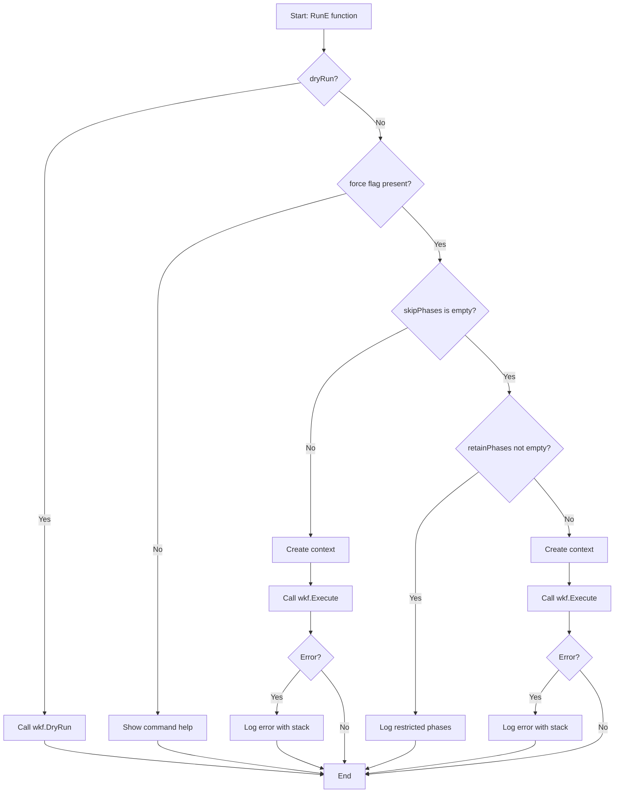
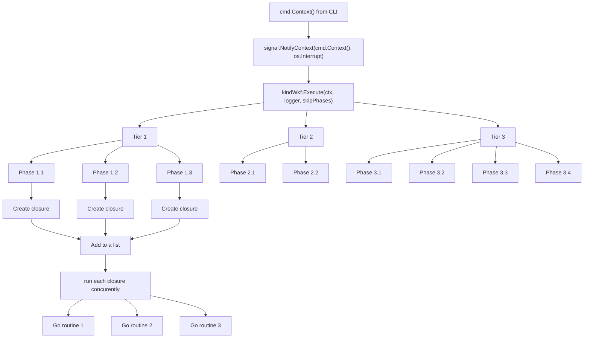

# Intro




This package defines the following concepts
- a **Task** is the conceptual idea of a single, atomic unit of work to be performed.
- a **Phase** 
  - is the concrete implementation of a **Task**
  - can simply be defined by a GO function (but not only)
  - is technically the following struct

	```go
	type Phase struct {
	Name        string
	Description string
	fn          PhaseFunc
	}
	```

- a **Workflow** is the the conceptual idea of a collection of one or more **tasks**
- a **Phase list** 
  - is the concrete implementation of a **Workflow**
  - can simply be defined by a list of **phases**
	- is technically the following struct

	```go
	type PhaseList []Phase
	```
- a **Step**is a synonym for a **Phase** or a **Task**.

-  a **DAG (Directed Acyclic Graph)** is the data structure we will use to represent the dependencies within a **Workflow**. It's a way to organize our **Phases**. it will allow to:
	- manage the order in which phases are run
	- manage dependencies if any between phases
	- manage any concurency run of phases

- an **adapater** that allows each phases to potentially run concurently using the package `syncx` 
- a **context** that allows to interact with long running process
- a **tier** is a set of phase that runs concurently
  - a tier can start only when all phases of the previous tier have finished running.


# How it works
- define a logger for your application that imlplements 
- define the sequence of function to play in sequence
```go
var mySequence = phase.NewPhaseList(
	phase.SetPhase("Setup", setupFunc, "Prepares the environment for the build."),
	phase.SetPhase("Build", buildFunc, "Compiles the source code into a binary."),
	phase.SetPhase("Test", testFunc, "Executes unit and integration tests."),
)
```
- run the sequence
```go
if err := mySequence.Run(log); err != nil {
    log.ErrorWithNoStack(err, "Workflow execution failed.")
    return
}
```


# Implemennting a Graceful Shutdown
**without context**
 - if your application is interrupted (e.g., via Ctrl+C)
 - the workflow will stop abruptly: potentially creating data corruption or orphaned processes


**improvemnt** 
 - add a mechanism to capture the interrupt signal
 - use the context.Context to stop all running Goroutines cleanly.
 - Prevent data corruption or orphaned processes for any long-running application.


**with context**
- We add a context that listens for an interrupt signal (like Ctrl+C). 
- When the signal is received, the context will be canceled.
- Propagate the context: The cancellable context will be passed to the workflow
- the Execute method will then pass the context to the syncx.RunConcurrently function.
- the syncx.RunConcurrently function will watch the context for a cancellation signal. 
- If the context is canceled, it will stop launching new goroutines and handle any currently running ones.


# The execute function
This is the cornerstone of the process that execute all phases of a worflow:

- From a set of phases (ie. a worflow):

| ID  | PHASE     | DESCRIPTION                                                        | DEPENDENCIES |
|-----|-----------|--------------------------------------------------------------------|--------------|
| 1   | checklist | check VMs are SSH reachable.                                       | none         |
| 2   | cpluc     | provision LUC CLI                                                  | none         |
| 3   | dapack1   | provision standard/required/missing OS CLI (via dnfapt packages).  | [upgrade]    |
| 4   | dapack2   | provision OS dnfapt package(s) on VM(s).                           | [upgrade]    |
| 5   | gocli     | provision Go toolchain                                             | [dapack1]    |
| 6   | linger    | Allow non-root user to run OS services.                            | [dapack1]    |
| 7   | path      | configure OS PATH envvar.                                          | [dapack1]    |
| 8   | rc        | Add a line to non-root user RC file.                               | [dapack1]    |
| 9   | service   | configure OS services on Kind VMs.                                 | [dapack1]    |
| 10  | show      | display the desired KIND Cluster's configuration                   | none         |
| 11  | upgrade   | provision OS nodes with latest dnfapt packages and repositories.   | [cpluc]      |

- It creates a set of tiers:

| Tier | PHASE     | DESCRIPTION                                                        | DEPENDENCIES |
|------|-----------|--------------------------------------------------------------------|--------------|
| 1    | checklist | check VMs are SSH reachable.                                       | none         |
| 1    | **cpluc**     | provision LUC CLI                                                  | none         |
| 1    | show      | display the desired KIND Cluster's configuration                   | none         |
| 2    | upgrade   | provision OS nodes with latest dnfapt packages and repositories.   | [cpluc]      |
| 3    | dapack1   | provision standard/required/missing OS CLI (via dnfapt packages).  | [upgrade]    |
| 3    | dapack2   | provision OS dnfapt package(s) on VM(s).                           | [upgrade]    |
| 4    | gocli     | provision Go toolchain                                             | [dapack1]    |
| 4    | **linger**    | Allow non-root user to run OS services.                            | [dapack1]    |
| 4    | path      | configure OS PATH envvar.                                          | [dapack1]    |
| 4    | rc        | Add a line to non-root user RC file.                               | [dapack1]    |
| 4    | service   | configure OS services on Kind VMs.                                 | [dapack1]    |

- some phases of the worflow can be skipped thus building a **filtered** set of tiers.
- suppose we want to **skip the phases**: `cpluc` and `linger`. the **filtered** set of tiers would be:


| Tier | PHASE     | DESCRIPTION                                                        | DEPENDENCIES |
|------|-----------|--------------------------------------------------------------------|--------------|
| 1    | checklist | check VMs are SSH reachable.                                       | none         |
| 1    | show      | display the desired KIND Cluster's configuration                   | none         |
| 2    | **upgrade**   | provision OS nodes with latest dnfapt packages and repositories.   | **[cpluc]**      |
| 3    | dapack1   | provision standard/required/missing OS CLI (via dnfapt packages).  | [upgrade]    |
| 3    | dapack2   | provision OS dnfapt package(s) on VM(s).                           | [upgrade]    |
| 4    | gocli     | provision Go toolchain                                             | [dapack1]    |
| 4    | path      | configure OS PATH envvar.                                          | [dapack1]    |
| 4    | rc        | Add a line to non-root user RC file.                               | [dapack1]    |
| 4    | service   | configure OS services on Kind VMs.                                 | [dapack1]    |

- There is a potential pbs with **upgrade** that originally depend on **cpluc**
- Now each tier is executed sequentially. this mean:
  - in a tier, all phases run **concurently**
  - For a **next** tier to start, all the phases of the **previous** tier must have finished running.
	- a phase is bind to a GO function that is wrapped into a `func() error` 
	- this func() is executed 


# How context is pass from cobra cli to goroutines


Got it 👍. To make this documentation **professional and production-grade**, we want:

* Clear context (what/why, not just what to do).
* Numbered steps with precise file references.
* Consistent formatting and section hierarchy.
* Explicit before/after code blocks.
* Notes on required updates across the codebase.
* Optional: test/verify section at the end.

Here’s a polished version:

---


# Howto

## Updating `PhaseFunc` Signature

- This howto explains how to update the `PhaseFunc` type, to accept a new parameter in it signature (a `logx.Logger`). 

- The same approach could be applies to other changes. 

> **Note**: after this update, all existing phases must be updated to comply with the new signature.

### Step 1: Update the type definition (`phase/type.go`)


**Before:**

```go
type PhaseFunc func(ctx context.Context, cmd ...string) (string, error)
```

**After:**

```go
type PhaseFunc func(ctx context.Context, l logx.Logger, cmd ...string) (string, error)
```

### Step 2: Update the adapter (`phase/adaptater.go`)

**Before:**

```go
func adaptToSyncxFunc(fn PhaseFunc, ctx context.Context, cmd ...string) syncx.Func {
	return func() error {
		_, err := fn(ctx, cmd...)
		return err
	}
}
```

**After:**

```go
func adaptToSyncxFunc(fn PhaseFunc, ctx context.Context, l logx.Logger, cmd ...string) syncx.Func {
	return func() error {
		_, err := fn(ctx, l, cmd...)
		return err
	}
}
```


### Step 3: Update the execution function (`phase/run.go`)

**Before:**


```go
task := adaptToSyncxFunc(phase.fn, ctx, []string{}...)
```

**After:**

```go
task := adaptToSyncxFunc(phase.fn, ctx, logx.GetLogger(), []string{}...)
```

---

### Step 4: Update all phase implementations

All phase functions must now accept a `logx.Logger` parameter.
For example:

**Before:**

```go
func MyPhase(ctx context.Context, cmd ...string) (string, error) {
    // implementation
}
```

**After:**

```go
func MyPhase(ctx context.Context, l logx.Logger, cmd ...string) (string, error) {
    l.Info("Starting phase...")
    // implementation
}
```


### Step 4: Check
at least:
1. Run `go vet   ./...`
1. Run `go test  ./...`

## Limitation of `PhaseFunc`
This howto explains how to go beyond the limitaion of type of var pass to `PhaseFunc` by using `context`. the idea is to
- create a context
- pass the var to the context
- use that context in a function (in a library) call done by an **emitter**
- when the function that was called (the **receiver**) will execute, it will retrieve that var from the context and use it

### Step 1: define a type
in a package accessible to the emitter and receiver
```go
package ctx

// here: an equivalent to a string
type contextKey string
```

### Step 2: define a key
That will be used both by **emitter** and **receiver** to identify the var
```go
// the key is shared by both and say: the value is of that type (contextkey)
const ExecutionIDKey contextKey = "executionID"
```

### Step 3: define the value
The emiter define a value
```go
// the type of the value is the same of the type above
mxExecutionId := "max-123-xyz"
```

### Step 4: pas value to the ctx
The emiter define a value
```go
// the type of the value is the same of the type above
ctx = context.WithValue(ctx, ctxdef.ExecutionIDKey, mxExecutionId)
```

### Step 5: call the PhaseFunc function
The emiter define a value
```go
// call the function that have the signature of PhaseFunc
workflow.ShowWorkflow(ctx, logger)
```
### Step 5: retriev the var from the context
The emiter define a value
```go
// inside ShowWorkflow: retrieve the var
execID, ok := ctx.Value(ctxdef.ExecutionIDKey).(string)
```

# Filtering phases in a workflow

This `whatis` pinpoint the way of filtering phases of a workflow

1. There is 2 modes
   * `skipPhases`
   * `retainPhases`

2. Build map for fast lookup

   * Skip mode → map contains phases to skip.
   * Retain mode → map contains phases to keep.

3. Build filtered list

   * Iterate each tier in `sortedPhases`.
   * Keep phases according to the mode:

     * Skip mode: keep if **not in skip map**.
     * Retain mode: keep if **in retain map**.
   * Append non-empty tiers to `filteredPhases`.


4. Return filtered phases
