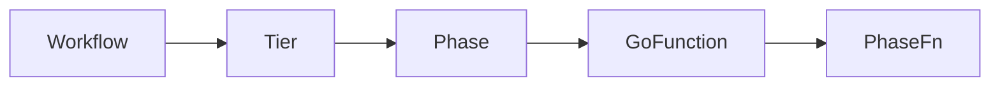

# Terminology
|concept/name |definition|comment|
|-|-|-|
|**worklow**|(is) a set of phases|described by a yaml file
|**tier**|(is) a ordered set of phases|
|**phase**|(represents) a `GO` function to be executed on **1..N** targets|accepts parameters|
|**target**|(is) the localhost, a remote VM or a container (local or remote)

# Purpose
A framework/engine that executes logic through the following hierarchy:

Each layer has a specific responsibility:

**workflow**
- at **compile** time: a set of `phases` described in a `YAML` file
- at **runtime**: a sequence of `tier`
- formal definition
	```go
	type Workflow struct {
		Name        string           `yaml:"name"`
		Description string           `yaml:"description"`
		Phases      map[string]Phase `yaml:"phases"`
	}
	```

**phase**
- Runs a function on one or many **targets** **concurrently**.
- formal definition
	```go
	type Phase struct {
	WkfName     string   `yaml:"wkfName,omitempty"`
	Name        string   `yaml:"name"`
	Description string   `yaml:"description"`
	FnAlias     string   `yaml:"fn"`
	Dependency  []string `yaml:"dependency,omitempty"`
	Param       []string `yaml:"param,omitempty"`
	Node        string   `yaml:"node,omitempty"`
	}
	```


# Execution Model
The field `dependency` of a `phase` **implies** the concept of **Tier**. 
- A **workflow** is made of several **phases**.
- Each phase may **depend** on zero or more other phases.
- From these dependencies, the engine automatically computes **tiers**:
- A **tier** contains multiple phases.


## Example without dependencies

```yaml
APhase: no dependencies  
BPhase: no dependencies  
CPhase: no dependencies  
DPhase: no dependencies
```

In that case, all phases are independent → they belong to the **same tier**. The tier layout is

```less
Tier 1:
   APhase ──┐
   BPhase ──┼── run in parallel
   CPhase ──┤
   DPhase ──┘
```

➡️ All 4 phases run **at the same time/concurently**, each of them **concurently on all target**.

---

## Example with dependencies

```yaml
APhase: []
BPhase: [APhase]
CPhase: [APhase]
DPhase: [BPhase, CPhase]
```

Now the engine creates **three tiers**.

### ✔ Tier 1

Only `APhase` has no dependencies.

```less
Tier 1:
   APhase   (run on all nodes)
```

### ✔ Tier 2

`BPhase` and `CPhase` both depend on `APhase` → they become parallel.

```less
Tier 2:
   BPhase ──┐
   CPhase ──┘   run in parallel after APhase
```

### ✔ Tier 3

`DPhase` depends on **both** B and C → it must wait for both.

```less
Tier 3:
   DPhase   (starts only when B and C are both done)
```

### Full tier layout

```less
Tier 1:
   APhase

(wait for A)

Tier 2:
   BPhase ──┐
   CPhase ──┘   run in parallel

(wait for B and C)

Tier 3:
   DPhase
```

## Conclusion
Operationally
* Tiers provide a natural *pipeline structure* for the workflow.
* The engine builds tiers automatically using dependencies.
* A phase consist of a uniq **GO** functions that run **concurrently** on all **targets**.

The following rules apply
* All phases in the same tier run in parallel.
* A phase:runs concurrently on all target nodes
* Tiers 
  - run **sequentially** (Tier 1 → Tier 2 → Tier 3).
  - A tier starts only when all phases in the previous tier have completed.


# Howto
## Collect errors from goroutine
1. each `goroutine` sends error (nil or not nil) into a `channel`
1. aggegate erros using a goroutine to avoid race condition
1. return the aggregate error


# Todo
- Use the CLI as a CI/CD pipeline tool
- Allow the CLI to use like the configuration file a custom worflow YAML file
