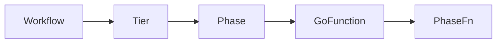

# Terminology
|concept/name |definition|comment|
|-|-|-|
|**worklow**|(is) a set of phases|described by a yaml file
|**tier**|(is) a ordered set of phases|
|**phase**|(represents) a `GO` function to be executed on **1..N** targets|accepts parameters|
|**target**|(is) the localhost, a remote VM or a container (local or remote)


## Overview

This framework executes **workflows** composed of **tiers → phases → targets**.
- It supports **concurrent execution** at the phase and target level
- structured **error handling** and **logging**.
- Phases delegate their logic to **functions with a uniform signature**, 

## Key Concepts

* **Workflow**: A collection of **tiers**, each containing **phases**.
* **Phase**: Defines a function to run on one or more **targets** with parameters.
* **Target**: The execution context for a phase (e.g., a node or a server).
* **FnRegistry**: Registry of all available functions for phases.

# Purpose
A framework/engine that executes logic through the following hierarchy:

Each layer has a specific responsibility:

**workflow**
- at **compile** time: a set of `phases` described in a `YAML` file
- at **runtime**: a sequence of `tier`
- formal definition
	```go
	type Workflow struct {
		Name        string           `yaml:"name"`
		Description string           `yaml:"description"`
		Phases      map[string]Phase `yaml:"phases"`
	}
	```

**phase**
- Runs a function on one or many **targets** **concurrently**.
- formal definition
	```go
	type Phase struct {
	WkfName     string   `yaml:"wkfName,omitempty"`
	Name        string   `yaml:"name"`
	Description string   `yaml:"description"`
	FnAlias     string   `yaml:"fn"`
	Dependency  []string `yaml:"dependency,omitempty"`
	Param       []string `yaml:"param,omitempty"`
	Node        string   `yaml:"node,omitempty"`
	}
	```


# Execution Model
The field `dependency` of a `phase` **implies** the concept of **Tier**. 
- A **workflow** is made of several **phases**.
- Each phase may **depend** on zero or more other phases.
- From these dependencies, the engine automatically computes **tiers**:
- A **tier** contains multiple phases.


## Example without dependencies

```yaml
APhase: no dependencies  
BPhase: no dependencies  
CPhase: no dependencies  
DPhase: no dependencies
```

In that case, all phases are independent → they belong to the **same tier**. The tier layout is

```less
Tier 1:
   APhase ──┐
   BPhase ──┼── run in parallel
   CPhase ──┤
   DPhase ──┘
```

➡️ All 4 phases run **at the same time/concurently**, each of them **concurently on all target**.

---

## Example with dependencies

```yaml
APhase: []
BPhase: [APhase]
CPhase: [APhase]
DPhase: [BPhase, CPhase]
```

Now the engine creates **three tiers**.

### ✔ Tier 1

Only `APhase` has no dependencies.

```less
Tier 1:
   APhase   (run on all nodes)
```

### ✔ Tier 2

`BPhase` and `CPhase` both depend on `APhase` → they become parallel.

```less
Tier 2:
   BPhase ──┐
   CPhase ──┘   run in parallel after APhase
```

### ✔ Tier 3

`DPhase` depends on **both** B and C → it must wait for both.

```less
Tier 3:
   DPhase   (starts only when B and C are both done)
```

### Full tier layout

```less
Tier 1:
   APhase

(wait for A)

Tier 2:
   BPhase ──┐
   CPhase ──┘   run in parallel

(wait for B and C)

Tier 3:
   DPhase
```

## Conclusion
Operationally
* Tiers provide a natural *pipeline structure* for the workflow.
* The engine builds tiers automatically using dependencies.
* A phase consist of a uniq **GO** functions that run **concurrently** on all **targets**.

The following rules apply
* All phases in the same tier run in parallel.
* A phase:runs concurrently on all target nodes
* Tiers 
  - run **sequentially** (Tier 1 → Tier 2 → Tier 3).
  - A tier starts only when all phases in the previous tier have completed.


# Howto
## Collect errors from goroutine
1. each `goroutine` sends error (nil or not nil) into a `channel`
1. aggegate erros using a goroutine to avoid race condition
1. return the aggregate error


# Function Pattern

All **phase functions** adhere to the same type:

```go
type PhaseFn func(target string, params [][]any, logger logx.Logger) (bool, error)
```
* `target`: the execution context (e.g., node, server, container)
* `params`: a 2D array of parameters for the function
* `logger`: logging interface
* Returns `true`/`false` for logical success, and an error for system failures

## Wrapper vs Core Functions

The framework distinguishes two layers:

1. **Wrapper functions**

   * Conform to the `PhaseFn` signature.
   * Extract parameters from `params`.
   * Loop over multiple items (nodes, repos, etc.).
   * Call the core, single-item function for each.
   * Aggregate results and handle errors/logging.

2. **Core functions**

   * Operate on a **single item** (node, repo, etc.).
   * Contain the **actual business logic**.
   * Return a success boolean and/or an error.

### Use Cases

| Wrapper Function                        | Core/Single-Item Function                                      | Description                                                                                                |
| --------------------------------------- | -------------------------------------------------- | ---------------------------------------------------------------------------------------------------------- |
| `MergeDevToMain(targetName, paramList)` | `MergeDevToMain(targetName, repoFolder, repoName)` | Wrapper iterates over multiple Git repositories; core function merges `dev` into `main` for a single repo. |
| `CheckSshConf(targetName, paramList)`   | `IsSshConfigured(targetName, nodeName)`            | Wrapper loops over nodes; core function checks SSH configuration for one node.                             |
| `CheckSshAccess(targetName, paramList)` | `IsSshReachable(targetName, nodeName)`             | Wrapper loops over nodes; core function checks SSH reachability for one node.                              |


### Summary

* **Wrapper functions**: handle **lists**, logging, and aggregation of errors.
* **Single-item functions**: implement the **actual logic** for one target/item.
* This pattern ensures **reusability** and **clean separation** between iteration and core logic.


# For ChatGPT


A lightweight workflow engine to execute **tiers → phases → targets** with **concurrent execution**, logging, and structured error handling.

## Phase Functions

All phase functions follow the same signature:

```go
type PhaseFn func(target string, params [][]any, logger logx.Logger) (bool, error)
```

* `target`: execution context (node/server)
* `params`: 2D array of parameters
* `logger`: logging interface
* Returns: logical success (`bool`) and error

## Wrapper, Single-Item, and Core Functions

| Type                 | Purpose                                                                                                    | Example                                                                                                                 |
| -------------------- | ---------------------------------------------------------------------------------------------------------- | ----------------------------------------------------------------------------------------------------------------------- |
| Wrapper              | Handles **lists**, extracts parameters, aggregates errors, conforms to `PhaseFn`                           | `MergeDevToMain(target, paramList)`, `CheckSshConf(target, paramList)`, `CheckSshAccess(target, paramList)`             |
| Single-Item Function | Executes logic on a **single item**, reusable outside workflow; may internally use **core functions**      | `MergeDevToMain(target, repoFolder, repoName)`, `IsSshConfigured(target, nodeName)`, `IsSshReachable(target, nodeName)` |
| Core Function        | Low-level operation that actually performs system or CLI commands; usually called by Single-Item Functions | `run.RunCli`, `git operations`, SSH command execution                                                                   |

**Pattern:**
Wrapper → iterates over items → calls Single-Item Function → internally calls Core Function → returns aggregated result.

**Note:** Core functions are the building blocks that implement the actual system-level logic; Single-Item Functions wrap these with business logic, and Wrappers orchestrate lists of items.

## example

## question
I need to create a lot of other functions of type
- core
- single-item
- wrapper

- before going too deep in it i need a methofology and a way to do that. 
- I want to give you an idea of what I want to do so that you help me distinguish what need to be codes as:
- wrapper
- single
- core

notice that i evolved in a linux env

I need to for several VM 
- scp file from a local machine to a sudo location on remote
- upgrade linux VM (any distro: rhel, ubuntu, fedora)
- update linux VM (any distro)
- create linux OS rc file (custom or not: ~/.profile, ~/.profile.custom)
- update the path at runtime and after rebbot
- define environment var that must be available at runtimle and after rebbot
- manage os services: start, stop, enable
- add native linux os package repository and package 
- loadOsKernelModule
- loadOsKernelParam
- confSelinux
- installGoCli in remote VM as sudo in folder /usr/local/bin

Let dive into a real example: "upgrade several remote VM running a linux OS".

Let's do it from scratch with the following methodology:
- I'll give you code
- You propose what will be code in the 3 part
  - wrapper
  - single-item
  - core
- Then you gave me the code step by step, one at a time
  - the core
- the single-item
- the wrapper

is it ok ?
# Todo
- Use the CLI as a CI/CD pipeline tool
- Allow the CLI to use like the configuration file a custom worflow YAML file

